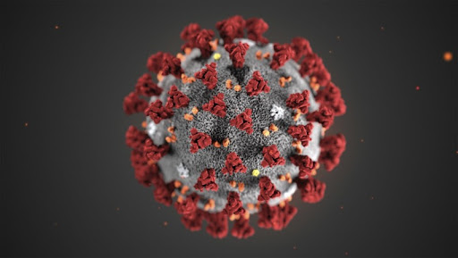

In Fall 2020, my team make a project in order to introduce the virus and find out possible treatments. We were asked for figure out strategies of fight against SARS-CoV-1. One was developing antiviral drugs, and the other is developing vaccines. For antiviral drugs, we wanted to produce monoclonal antibodies to bind the epitopes/spikes/S protein which presents on the viral surface. If the S protein was bound, the chance of binding to the lung cell surfaces will decrease; prevent the virus getting into the cells. For vaccine, we wanted to use microvesicles to deliver S protein to the body, so appropriate immune response can be generated. In addition, nasal sprays is the tool we wanted to use because the viral transmission is through aerosol route. Epithelium alveoli in the lung will contact with the viral particle first, so that IgA (which is mainly found in the mucous membranes) will take care of the virus; they are produced by plasma cells which induced by the nasal sprays.
 
Virology course: <a href="https://manoa.hawaii.edu/catalog/courses/micr-490-virology-3/"><i class="large github icon"></i>MICR 490</a>
