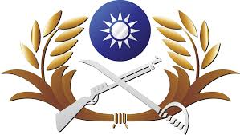

  

As a citizen in Taiwan, each male was born before 1994 has the duty to serve in the military for one year. After I graduated from 5-year-college, I decided to finished the duty first. It was the first time for me to live with a lot of strangers for almost 24 hours each day. I am not a extrovert, so I don't enjoy hanging out with people for very long time. However, teamwork and communication are inevitable in the military. Besides, all the training made me think more about how the community works and how to perform works with many people. Each person had to take responsibility in order to avoid punishments because Collective punishment.

It was a excellent experience because the military is like as mini-society where I can observe many real world issues. Those issues might not able to be recognized while I am studying in the educational institution, like schools. I think serving in the military could be considered an intern because I actually did the job and take responsiblity of it.

Besides, I also can see the value of management. The leadership is significant for uniting the whole group. Punishment and encouragement have their different purposes, and probably both are indispensable. I was able to point out the pros and cons of each management style while other people just complaining and muddle along until leaving. 

You can learn more at the [Republic of China Army](http://army.mnd.gov.tw).

